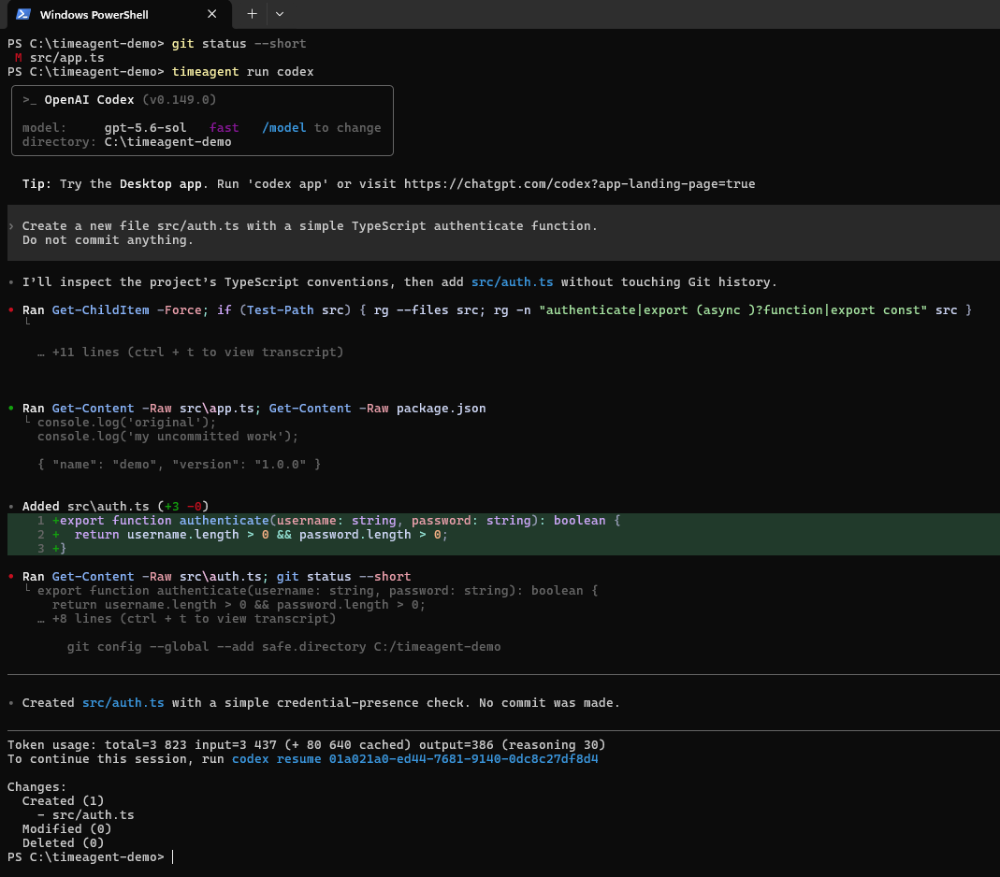
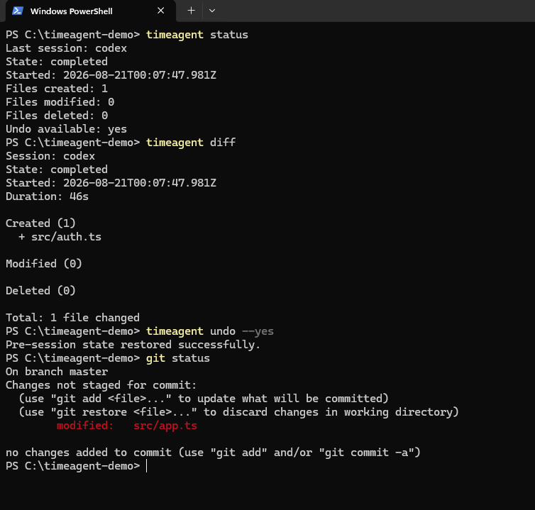

<p align="center">
  
</p>

# TimeAgent

Undo coding-agent changes without losing the work you had before the agent started.

## Experimental software

TimeAgent is experimental software. Version 0.2 adds a limited external-action awareness prototype to the existing filesystem checkpoint and undo system. Try it first on disposable or test repositories, keep normal backups and version control, and review `timeagent diff` before relying on an undo. TimeAgent is not a replacement for Git or a security sandbox.

## The problem

Git can restore committed code, but developers often start an AI coding session with uncommitted work, untracked files, or ignored local files. TimeAgent captures the repository's filesystem state immediately before the child command starts and can restore that state afterward.

## Example

```sh
timeagent run codex
timeagent diff
timeagent undo
```

TimeAgent can also wrap other compatible command-line coding agents:

```sh
timeagent run claude
```

TimeAgent runs an arbitrary child command. These examples do not imply an official integration or partnership with OpenAI, Anthropic, Codex, or Claude.

## Demo

Run a coding-agent session while preserving the repository's pre-session state:



Inspect the completed session, review its diff, and restore the original state:



## Installation from source

TimeAgent is not documented as an npm registry package in this release. Clone the public GitHub repository:

```sh
git clone https://github.com/mohamederrahali34/timeagent.git
cd timeagent
npm install
npm run build
npm link
```

Node.js 20 or newer and Git are required.

## Commands

```text
timeagent run [--allow-high-risk] <command> [args...]
timeagent status
timeagent status --json
timeagent actions
timeagent actions --json
timeagent diff
timeagent diff --json
timeagent diff-file <repository-relative-path> --json
timeagent diff --patch
timeagent undo
timeagent undo --yes
```

- `run` captures a pre-session checkpoint, runs the child command with inherited terminal input/output, and records created, modified, and deleted files. It also prepends limited command proxies to the child process's `PATH`.
- `run --allow-high-risk` is an explicit experimental policy that permits intercepted high- and critical-risk commands. Without it, non-interactive sessions fail closed and interactive sessions ask with a default of No.
- `status` reports whether the latest checkpoint is active, completed, interrupted, invalid, or absent, plus external-action counts.
- `actions` displays the read-only action log for the current session.
- `status --json`, `diff --json`, `diff-file <path> --json`, and `actions --json` expose the stable, versioned `schemaVersion: 1` interface used by integrations. Successful JSON commands write JSON only to stdout; errors are written to stderr.
- `diff` compares the pre-session state with the recorded post-session state. For interrupted sessions, it compares with the current repository state and displays a warning.
- `diff-file <path> --json` returns the validated before/after text for one file listed by the current session diff. It rejects absolute, traversal, internal-storage, unchanged, cross-repository, and symlink/junction escape paths. Binary contents are withheld, and text larger than 1 MiB is reported as unavailable rather than loaded into memory.
- `diff --patch` also displays a simple textual patch. Binary files and files larger than 1 MiB are not rendered as text.
- `undo` restores the pre-session filesystem state. It asks before overwriting changes made after a session or recovering an interrupted session.
- `undo --yes` explicitly confirms that restoration for non-interactive or scripted use.

Arguments are passed directly to the child process without rebuilding a shell command string. Invoke a shell explicitly when shell syntax is required:

```sh
timeagent run sh -c "npm test && npm run build"
```

PowerShell example:

```powershell
timeagent run powershell -NoProfile -Command "'test' | Out-File result.txt"
```

## Crash recovery

If the TimeAgent process or terminal is interrupted before finalization, a recovery checkpoint may remain in `.timeagent/pending/`.

```sh
timeagent status
timeagent undo
```

TimeAgent validates the checkpoint metadata, canonical repository root, paths, and saved file hashes before offering recovery. Interrupted-session recovery always requires explicit confirmation. If input is not interactive, restoration is refused unless `timeagent undo --yes` is used.

## What TimeAgent currently protects

TimeAgent checkpoints local files inside the repository, excluding `.git/` and `.timeagent/`. The current implementation covers:

- files created, modified, or deleted during the session;
- Git-tracked files;
- untracked files;
- ignored files;
- pre-existing user modifications present before `timeagent run`.

Only the latest session is retained.

## Experimental external-action awareness

TimeAgent v0.2 creates session-local `PATH` proxies for a small explicit list of package, database, deployment, and infrastructure tools. When a wrapped child process resolves one of these tools through `PATH`, the proxy records its executable name, exact argument array, working directory, category, risk, status, and the fact that TimeAgent cannot reverse it. Medium-risk package-manager actions are allowed and logged. High- and critical-risk actions require interactive approval or the explicit `--allow-high-risk` policy.

The durable log is stored with the checkpoint in `.timeagent/last/actions.json`; while a session is running or after a crash, individual atomic action records remain under `.timeagent/pending/actions/`.

This mechanism is intentionally limited and bypassable. It does not intercept:

- binaries invoked with an absolute or otherwise explicit path;
- commands after a child replaces or removes TimeAgent's `PATH` entry;
- shell built-ins, aliases, renamed tools, or tools not in the explicit proxy list;
- native child-process execution that bypasses command lookup;
- API calls or remote side effects that do not use an intercepted executable.

Detection is not containment. A child process already has the same operating-system permissions as the user, and remote actions are not automatically reversible. The action log must not be treated as complete audit evidence.

## What TimeAgent does not protect

TimeAgent does not roll back effects outside the repository filesystem, including:

- remote databases;
- external APIs;
- cloud infrastructure;
- deployments;
- emails or messages sent by an agent;
- other external side effects;
- secrets changed outside the repository;
- arbitrary operating-system state outside the repository.

TimeAgent does not preserve every advanced filesystem attribute such as ACLs, ownership, and timestamps. It primarily restores file contents, file and directory presence, basic modes, and symbolic-link targets.

An interrupted restoration can also leave a partially restored working tree if the operating system fails during file replacement. The checkpoint is retained unless restoration completes successfully.

## How it differs from Git

Git versions repository history. TimeAgent captures the immediate pre-agent filesystem state, including user work that may not be committed, tracked, or normally included in Git history. The tools are complementary.

## Development

```sh
npm install
npm run build
npm test
```

The test suite includes real nested child processes, external-action policy checks, separate CLI invocations, crash-recovery scenarios, PowerShell argument handling on Windows, and conditional platform-specific signal tests. Platform-specific tests are skipped when the host cannot support them. A public CI matrix has not yet been configured.
